# Ejercicio 1: Gestión de Seguros en una Aplicación Spring Boot con Kotlin
# Capa Model
 Representa objetos que corresponden a las tablas de la base de datos
## Data class Seguro
### [Enlace a Seguro](src/main/kotlin/com/example/unsecuredseguros/model/Seguro.kt)  
Uso anotaciones como @Min o @NotNull, para validar los campos justo antes de introducirlos a la base de datos

```kotlin
@Entity
@Table(name = "seguros")
data class Seguro(
    @Id
    @GeneratedValue(strategy = GenerationType.IDENTITY)
    @Column(name = "idSeguro")
    val idSeguro: Long = 0,

    @NotNull
    @Column(length = 10)
    var nif: String,

    @NotNull
    @Column(length = 100)
    var nombre: String,

    @NotNull
    @Column(length = 100)
    var ape1: String,

    @Column(length = 100)
    var ape2: String? = null,

    @Min(18)
    @Column(nullable = false)
    var edad: Int,

    @Min(0)
    @NotNull
    @Column(name = "num_hijos")
    var numHijos: Int,

    @NotNull
    @Column(name = "fecha_creacion")
    var fechaCreacion: LocalDateTime,

    @NotNull
    @Column(length = 10)
    var sexo: String,

    @NotNull
    @Column
    var casado: Boolean,

    @NotNull
    @Column
    var embarazada: Boolean
)
```
## Capa Repository
### ISeguroRepository
#### [Enlace a ISeguroRepository](src/main/kotlin/com/example/unsecuredseguros/repository/ISeguroRepository.kt)
La uso para conectarse a la base de datos y abstraer el resto de capas  
Heredo de la interfaz [JpaRepository](https://docs.spring.io/spring-data/jpa/docs/current/api/org/springframework/data/jpa/repository/JpaRepository.html) para tener métodos CRUD y usarlos posteriormente en la Capa Service
```kotlin
@Repository
interface ISeguroRepository: JpaRepository<Seguro, Long> {
}
```
## Capa Service
Esta capa gestiona la lógica de negocio de la aplicación y actua como intermediario entre la capa controller y la capa repository
### SeguroService
#### [Enlace a SeguroService](src/main/kotlin/com/example/unsecuredseguros/service/SeguroService.kt)
En las funciones **insert** y **update** devuelvo la clase la clase *Any* de la que heredan todas las clases de Kotlin para poder mostrar en el controller mensajes de control de errores como *DNI no válido*, *Edad no válida* y no que simplemente devolver **null** sin saber qué está mal  
```kotlin
@Service
class SeguroService() {

    @Autowired
    private lateinit var iSeguroRepository: ISeguroRepository

    fun getById(id: String): Seguro? {
        val idL = id.toLongOrNull() ?: return null

        return iSeguroRepository.findByIdOrNull(idL)
    }

    fun deleteById(id: String): Boolean {
        val idL = id.toLongOrNull() ?: return false
        try {
            iSeguroRepository.deleteById(idL)
            return true
        } catch (e: Exception) {
            e.printStackTrace()
            return false
        }
    }
    fun getAll(): List<Seguro> {
        return iSeguroRepository.findAll()
    }

    fun insert(seguro: Seguro): Any {
        val seguroCheckeado = Utilidades.validarSeguro(seguro)
        if (seguroCheckeado != null) return seguroCheckeado

        return try {
            iSeguroRepository.save(seguro)
        }catch (e:Exception){
            e.printStackTrace()
            "Error al insertar el seguro"
        }
    }

    fun update(seguro: Seguro): Any {
        val seguroCheckeado = Utilidades.validarSeguro(seguro)
        if (seguroCheckeado != null) return seguroCheckeado

        val seguroExistente = iSeguroRepository.findByIdOrNull(seguro.idSeguro) ?: return "ID del seguro no exite"


        seguroExistente.nombre = seguro.nombre
        seguroExistente.ape1 = seguro.ape1
        seguroExistente.ape2 = seguro.ape2
        seguroExistente.edad = seguro.edad
        seguroExistente.numHijos = seguro.numHijos
        seguroExistente.fechaCreacion = seguro.fechaCreacion
        seguroExistente.sexo = seguro.sexo
        seguroExistente.casado = seguro.casado
        seguroExistente.embarazada = seguro.embarazada

        return try {
            iSeguroRepository.save(seguro)
        }catch (e:Exception){
            e.printStackTrace()
            "Error al insertar el seguro"
        }
    }
}
```
## Capa Controller
Maneja las peticiones HTTP y es la capa que interatua con el cliente
### SeguroController
#### [Enlace a SeguroController](src/main/kotlin/com/example/unsecuredseguros/controller/SeguroController.kt)
```kotlin
@RestController
@RequestMapping("/seguros")
class SeguroController() {

    @Autowired
    private lateinit var seguroService: SeguroService

    @GetMapping("/{id}")
    fun getById(
        @PathVariable id: String?
    ): Seguro? {

        if (id.isNullOrEmpty()) return null

        return seguroService.getById(id)
    }

    @GetMapping
    fun getAll(): List<Seguro> {
        return seguroService.getAll()
    }

    @PostMapping
    fun insert(
        @RequestBody seguro: Seguro?
    ): Any {
        if (seguro == null) return "Introduce un seguro"
        return seguroService.insert(seguro)
    }

    @DeleteMapping("/{id}")
    fun deleteById(
        @PathVariable id: String?
    ): Boolean {
        if (id.isNullOrEmpty()) return false
        return seguroService.deleteById(id)
    }
    
    @PutMapping
    fun update(
        @RequestBody seguro: Seguro?
    ):Any{
        if (seguro == null) return "Introduce un seguro"
        return seguroService.update(seguro)
    }
}
```
## Utilidades
#### [Enlace a Utilidades](src/main/kotlin/com/example/unsecuredseguros/utils/Utilidades.kt)
Tengo un objeto **Utilidades** que lo uso para llamar a funciones estáticas como **validarDni** o **validarSeguro**, así consigo un código más limpio dentro de la capa **Service**
```kotlin
object Utilidades {
fun validarDni(dni: String): Boolean {
    val dniRegex = Regex("^[0-9]{8}[A-Z]$")
    if (!dniRegex.matches(dni)) return false
    
            val dniNumeros = dni.substring(0, 8).toIntOrNull() ?: return false
            val dniLetra = dni.last()
            val letras = "TRWAGMYFPDXBNJZSQVHLCKE"
    
            return dniLetra == letras[dniNumeros % 23]
        }
    
        fun validarSeguro(seguro: Seguro): String? {
            if (!Utilidades.checkDni(seguro.nif)) return "El NIF no es válido"
            if (seguro.nombre.isEmpty()) return "El nombre no puede estar vacío"
            if (seguro.ape1.isEmpty()) return "El primer apellido no puede estar vacío"
            if (seguro.edad <= 0) return "La edad debe ser mayor que 0"
            if (seguro.edad in 0..17) return "No es posible ser menor de edad para hacer un seguro"
            if (seguro.sexo.isEmpty()) return "El campo sexo no puede ser null"
            if (seguro.numHijos < 0) return "El número de hijos no puede ser menor que 0"
            if (!seguro.casado && seguro.numHijos != 0) return "Si no está casado, el número de hijos debe ser 0"
            if (seguro.embarazada && seguro.sexo != "Mujer") return "Si está embarazada, el sexo debe ser 'Mujer'"
    
            return null  // Todos los campos son válidos
        }
    }
```
# Capturas Funcionamiento
## **GET** `/seguros`
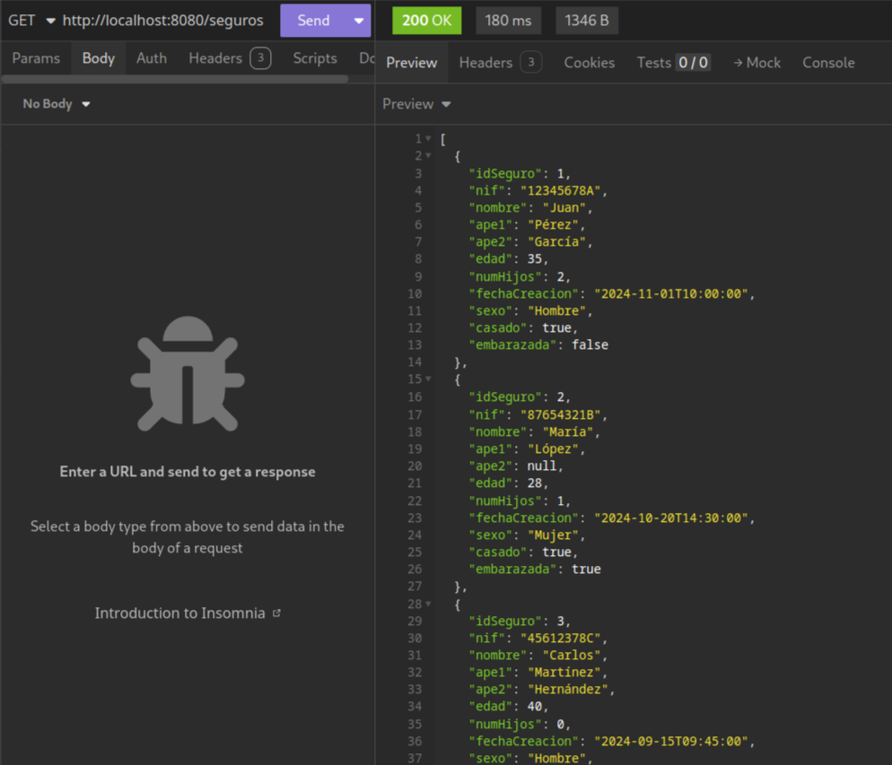
## **GET** `/seguros/{id}`
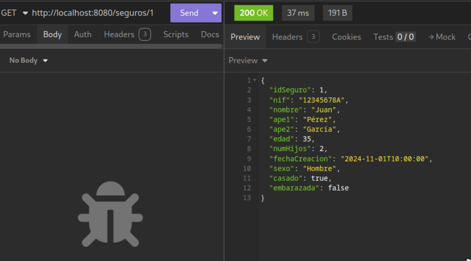
## **POST** `/seguros`
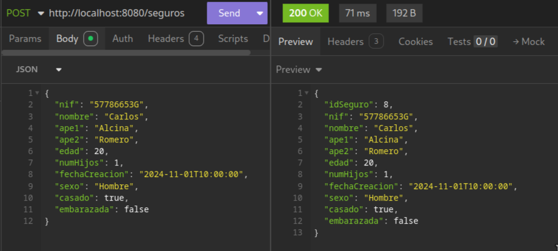
### Validaciones POST & PUT
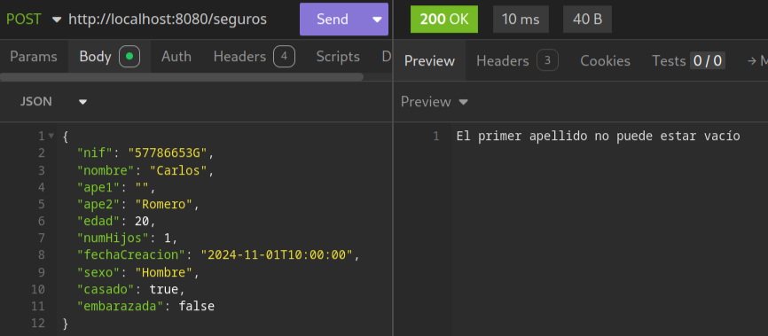
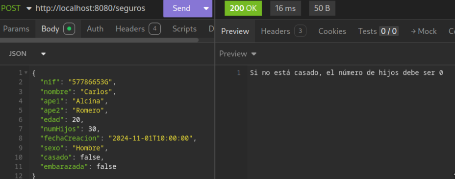
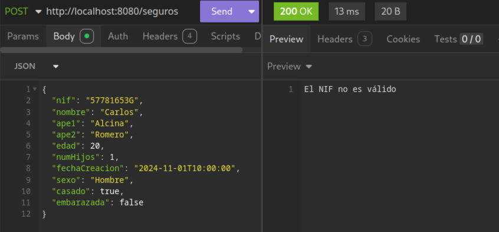
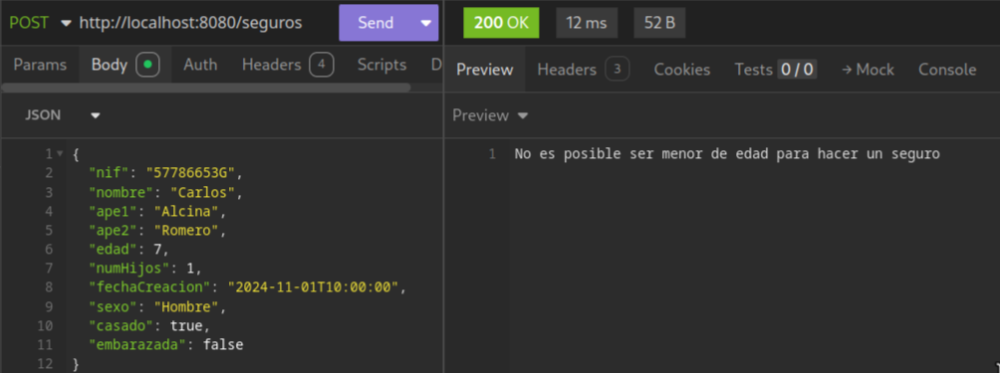
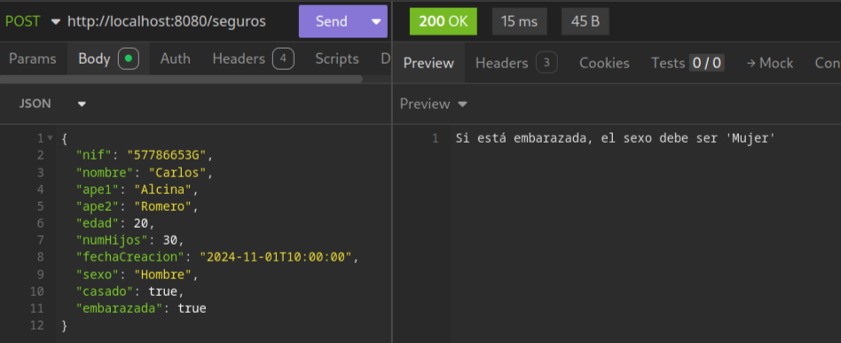
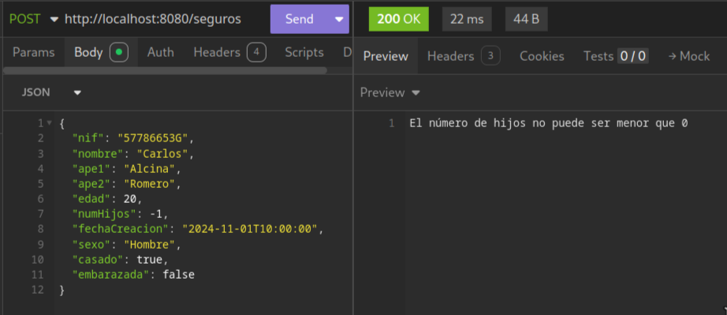
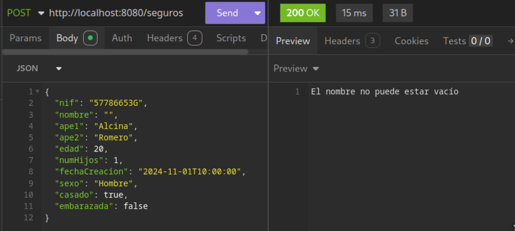
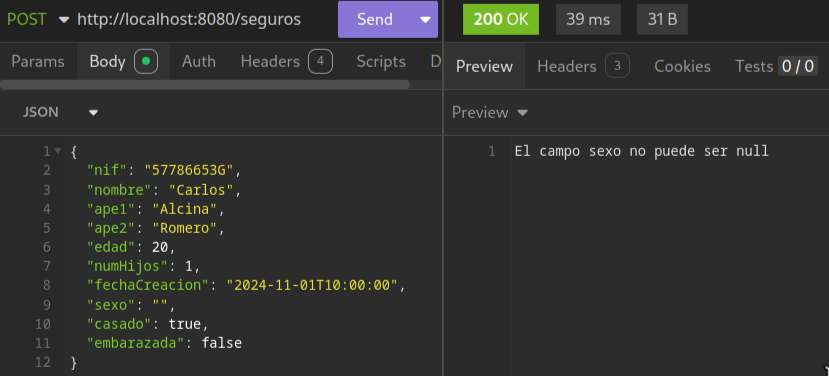
## **PUT** `/seguros/{id}`
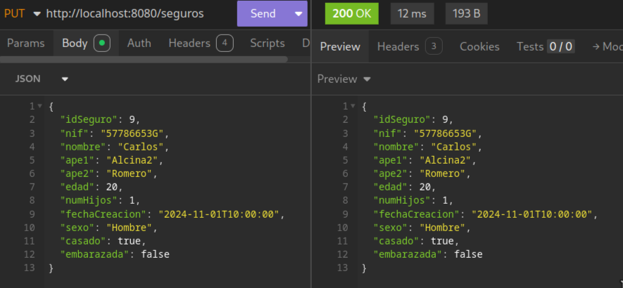
## **DELETE** `/seguros/{id}`
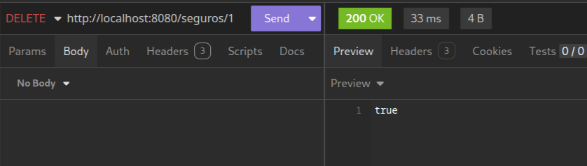

# Enunciado
En este ejercicio, vamos a desarrollar una aplicación básica en **Spring Boot** utilizando **Kotlin** que permita gestionar entidades de tipo **Seguro**. La aplicación deberá implementar un conjunto de operaciones CRUD a través de métodos HTTP para interactuar con la tabla asociada al modelo de datos.

## Parte 1: Definición de la Entidad y Controlador

### 1. Entidad Seguro
Crea una clase de datos en Kotlin que represente la entidad **Seguro** con los siguientes atributos:

```kotlin
data class Seguro(
    val idSeguro: Int,
    val nif: String,
    val nombre: String,
    val ape1: String,
    val ape2: String?,
    val edad: Int,
    val numHijos: Int,
    val fechaCreacion: Date,
    val sexo: String,
    val casado: Boolean,
    val embarazada: Boolean
)
```

**Modelo de la base de datos (Tabla Seguro):**

```sql
CREATE TABLE seguros (
    idSeguro INTEGER PRIMARY KEY,
    nif VARCHAR(10) NOT NULL,
    nombre VARCHAR(100) NOT NULL,
    ape1 VARCHAR(100) NOT NULL,
    ape2 VARCHAR(100),
    edad INTEGER NOT NULL CHECK (edad > 0),
    num_hijos INTEGER NOT NULL CHECK (num_hijos >= 0),
    fecha_creacion TIMESTAMP NOT NULL,
    sexo VARCHAR(10) NOT NULL,
    casado BOOLEAN NOT NULL,
    embarazada BOOLEAN NOT NULL
);
```

### 2. Validaciones a implementar en la capa service

- El campo `nif` debe ser válido (formato correcto).
- El campo `nombre` no puede estar vacío.
- El campo `ape1` no puede estar vacío.
- El campo `edad` debe ser mayor que 0.
    - Si `edad` está entre 0 y 17 años, deberá indicar que **"No es posible ser menor de edad para hacer un seguro"**.
- El campo `sexo` no puede ser `null`.
- El campo `numHijos` no puede ser menor que 0.
- Si el campo `casado` es `false`, el campo `numHijos` debe ser igual a 0.
- Si el campo `embarazada` es `true`, el campo `sexo` debe ser **"Mujer"**.

### 3. Controlador SeguroController

Implementa una clase `SeguroController` con los endpoints necesarios para realizar operaciones CRUD sobre la entidad **Seguro**. Cada endpoint deberá cumplir con las validaciones descritas anteriormente.

### Operaciones CRUD

- **GET** `/seguros`:  
  Devuelve una lista de todos los seguros registrados.

- **GET** `/seguros/{id}`:  
  Devuelve un seguro por su identificador `idSeguro`. Si no existe, retorna un error 404.

- **POST** `/seguros`:  
  Crea un nuevo seguro.
    - Valida los campos siguiendo las restricciones mencionadas.

- **PUT** `/seguros/{id}`:  
  Actualiza un seguro existente identificado por `idSeguro`.
    - Si no existe, retorna un error 404.
    - Aplica las validaciones antes de guardar los cambios.

- **DELETE** `/seguros/{id}`:  
  Elimina un seguro identificado por `idSeguro`. Si no existe, retorna un error 404.

### Requisitos del Entorno

1. Crea un proyecto en **Spring Boot** con las siguientes dependencias:
    - **Spring Web**
    - **Spring Data JPA**
    - **MySQL Database** (o el sistema de base de datos de tu elección)
2. Configura la base de datos en el archivo `application.properties`.

### Entrega

1. Código de la entidad `Seguro` con sus campos.
2. Código del service `SeguroService` con sus validaciones.
3. Código del controlador `SeguroController` con los endpoints definidos.
4. Pruebas funcionales utilizando Postman o Swagger para demostrar el correcto funcionamiento de las operaciones CRUD.
5. Realiza un documento donde incluyas todos los puntos anteriores, junto con las explicaciones, pantallazos y comentarios que creas convenientes para que esta parte de la aplicación quede correctamente explicada.

## Sugerencia de Validación en Spring Boot

Puedes usar anotaciones de validación estándar como `@NotNull`, `@Min`, `@Max`, `@Pattern`, o crear validadores personalizados según sea necesario.
